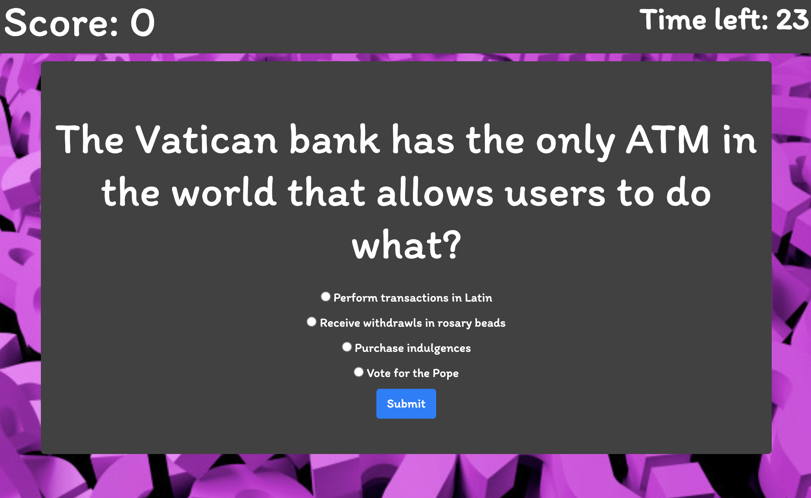
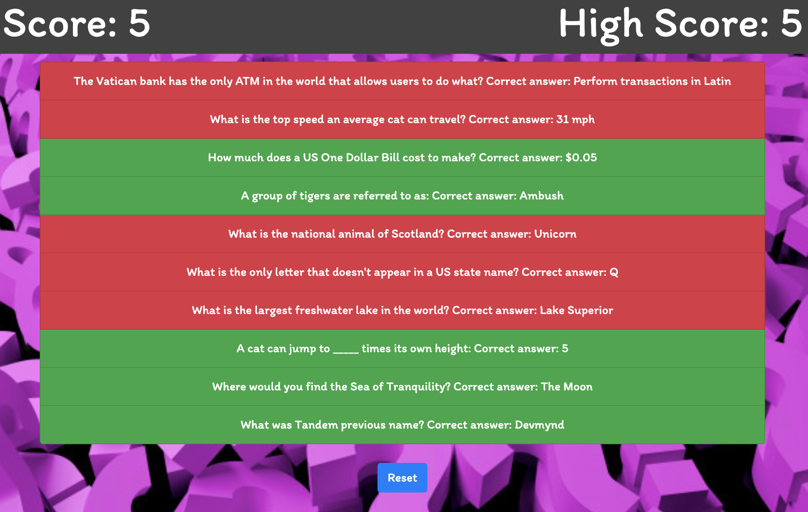

## Trivia Night

Test your knowledge with this trivia game! Play a round of 10 questions and try to beat your high score. Get your answers in before the timer runs out! Deployed [here](https://puglisac.github.io/trivia-night/).  

## Tech Used

- JavaScript
- High score stored in LocalStorage
- html/css
- Styled with Bootstrap
- Testing with Jasmine

## Installation
### To install, follow these steps:

Via Downloading from GitHub:

Download this repository onto your machine by clicking the "Clone or Download" button or Fork the repo into your own Github account
Download and extract the zip file to a directory of your choice.  

Via command line:

`$ git clone https://github.com/puglisac/trivia-night.git`  

To launch the app in the browser open: index.html

To run tests open: index-text.html